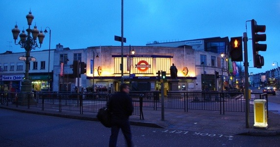
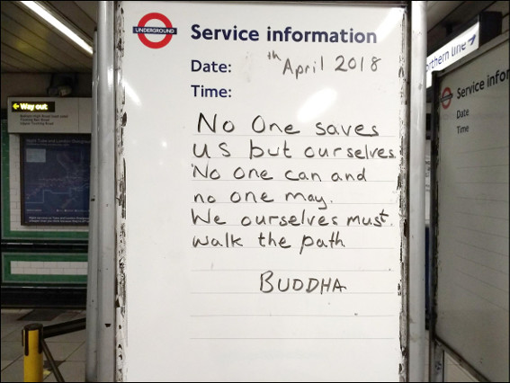

# The Northern Line to High Reality via Bank

This book is published on May 18th 2019.

50 Tube stations on the Northern Line photographed at dusk and dawn. Transport for London staff have placed some enlightening quotes at the entrance to some of the stations. This book shares the photographer's reflection on 51 quotes and links to resources, to progress the reader to a 'higher dream', a 'high' reality.  

---

Online references for the printed book: [References](cite.md)

Book details: [Book details](nlmetta.md)

Key statements: [https://github.com/alwell/alwell.github.io/blob/master/northerline.pdf](https://github.com/alwell/alwell.github.io/blob/master/northerline.pdf)

[Contact the author](https://docs.google.com/forms/d/e/1FAIpQLSf5lxYq2sVNpwgGuSzN51IMZVEdLB_KhzTKzqvW3hQo9CcZVg/viewform?usp=sf_link)

