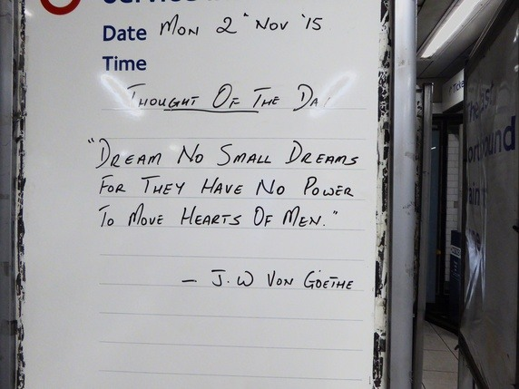

# The Northern Line and the path to ultimate enlightenment

### Note to Film Office TFL. Owing to complications of copyright etc, I only seek to have permission to use the exterior pictures of the Northern Line tube stations for a commercial book. I will not be using the actual quotes from the tube line placed there by staff.This has been revised as from 12.00pm 28th June 2018.

The Tube; grimy; smelly; crowded; necessary and efficient. There were about 294 million passenger journeys recorded in 2016/17 on the Northern line, making it the busiest on the Underground (Wikipedia). We could perhaps describe the tube as a bitter remedy for transport.

Amazingly, emerging from this grime are some enlightening quotes that the TFL staff have placed at the entrance to some of the stations. It as if they are preparing the traveller for something deeper and higher. The purpose of this project is to use some Buddhist quotes to progress to something deeper and higher, the highest goal of human achievement, enlightenment. Each quote will be from a quote from the original teachings of the Buddha, on the topic of a path, journey, dawn etc.

The Northern Line also has a great advantage over outer space in seeking to understand the world on account of its cost, £1.50 Oyster as opposed to 1.3 trillion dollars to go to Mars!

The output of the project will be a printed coffee table book, web site, an online slide presentation, Youtube video and  photographic exhibition. 

It will be heavily picture led. There will be 50 pictures of each station along the Northern Line taken in half light. These will then form the basis of 50 chapters. At night time, the stations take on a different personalty and often become the main focal point of the community. The are like miniature temples lighting up their surroundings. Each picture will represent an entry to this path to understanding. Each station picture will be accompanied by a written quote from the Buddha. There will also be some interesting facts about the Northern Line and each station.

The author, Alan Weller has been a professional photographer for 30 years and is also a leading publisher of Theravada Buddhist books worldwide. These books go into 24 different countries (www.zolag.co.uk). 
He also given three presentations on 'higher reality' at education research conferences; UEL Research conference 2015; ICERI Barcelona 2017 and 9th TEAN Conference 2018. He is currently a Senior Lecturer in Physics at University of East London and therefore understands the domains of science and of mindfulness at understanding the world.
